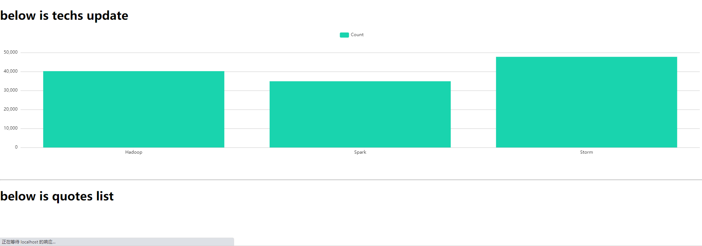

## Full Stack Web Application

### Purpose

This is a demo project for showing how one full stack web application should be like.

### Introduction

features:
- [X] scrawler get data into database
- [X] webserver push data to browser periodically 

---

## Demo



## workflow

1. scratch quotes from scrapy offical demo site(quotes), save to database(MongoDB), and show them through web.
2. Front end is vue.js project, including WebSocket client(socketio) component.
3. Back end is websocket server, which query data form MongoDB through ORM mongoose every period(1s), pushing quotes data to front end.
4. data picker use scrapy to crawl quotes to save to MongoDB.


---

## technology stack

Scrapy + webservice[restful] + websocket + VueJS + MongoDB

| Component | Description |
| ----------- | ----------- |
| Scrapy | scratch data from web |
| webservice | serve restapi for data storation and fetch |
| websocket | push data to browser |
|  VueJS | frontend |
| MongoDB | DB |

---

## Install

``` bash

./bin/install.sh

```

## Run

``` bash
# run all services
./bin/start.sh

# stop all services
./bin/stop.sh

# start scrapy
./bin/start_scrapy.sh
```


## Reference
- [x] [mongodb install](https://www.howtoforge.com/tutorial/install-mongodb-on-ubuntu-18.04/)


